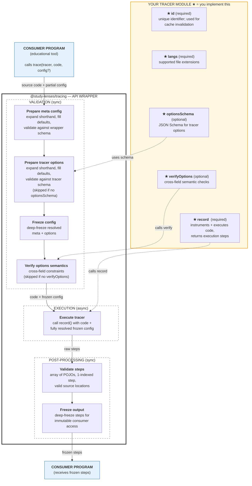

# @study-lenses/trace-js-klve — Architecture & Decisions

## Why this tracer exists

Instruments JavaScript source code using the Babel AST and the klve engine by
Kelley van Evert ([jsviz.klve.nl](https://jsviz.klve.nl)), returning a step-by-step
execution trace. Exists as a separate package so other `@study-lenses` tracers
(Python, WASM, etc.) can follow the same `TracerModule` contract without coupling.

## Architecture

```text
code (string)
  → record/index.ts        ← adapter (error mapping, step renumbering)
  → record/trace.ts       ← Babel instrumentation + sandboxed execution (external)
  → record/filter-steps.ts ← post-trace filtering (external)
  → TracerStep[]           ← returned via @study-lenses/tracing wrappers
```

`src/index.ts` is wire-up only — no logic. All tracer logic lives in `record/`.

### Full Pipeline Diagram



## Key decisions

### Why Babel (`@babel/standalone`)

AST-based instrumentation gives step-level granularity — one step per expression
evaluation — without modifying the user's observable semantics. The alternative
(line-by-line stepping via a debugger protocol) is far more complex to set up and
less portable.

### Why the engine is treated as external

`trace.ts`, `filter-steps.ts`, `ast-map.ts`, and `types.ts` are pre-existing code
by Kelley van Evert. They are excluded from linting and TypeScript strict checking.
The adapter (`record/index.ts`) is the only file we own in `record/` — it maps
engine errors to standard error types and renumbers steps to 1-indexed.

### Why steps are 0-indexed internally and 1-indexed in output

The klve engine uses 0-indexed steps internally. Output is renumbered to 1-indexed
in `record/index.ts` because step 1 is the expected convention for consumers
(educational tools display "Step 1", not "Step 0").

### Why options use JSON Schema + verifyOptions

JSON Schema (draft-07) validates structure and types. `verify-options/` handles
the `filter.names.include` / `filter.names.exclude` mutual exclusion constraint,
which JSON Schema cannot express. Separating them keeps the schema machine-readable
for tooling while still enforcing semantic rules.

## What this package deliberately does NOT do

Does not interpret, display, or pedagogically frame the trace. That is the consumer's
responsibility. Does not own the klve engine — `record/index.ts` is an adapter only.
